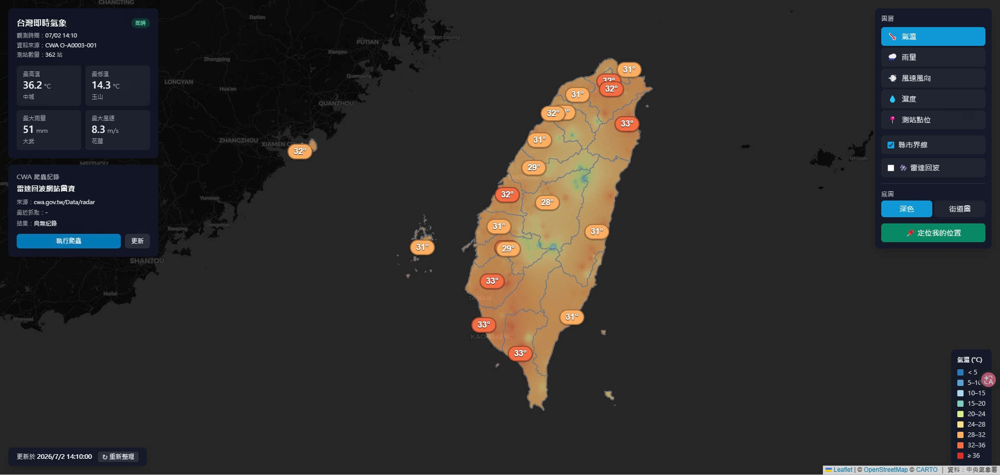

# 台灣即時氣象視覺化地圖

類 Windy 風格的台灣即時氣象地圖，但**沒有使用 Windy 的 API、圖磚、資料或內嵌服務**。本專案的重點是自行整合公開氣象資料，並用 Leaflet、Canvas、IDW 內插與 NOAA GFS 風場格點，實作出接近 Windy 的平滑填色與粒子風場視覺。主要資料來源為**中央氣象署開放資料平台 API**；後端負責抓取、清洗、快取並轉成乾淨 GeoJSON，前端呈現測站、氣溫/雨量填色場、風向箭頭、雷達動畫、天氣特報與縣市界線。

## 核心亮點：未使用 Windy，自行實作類 Windy 視覺

這不是把 Windy 嵌進網頁，而是從資料取得、格式轉換、空間內插到前端動畫都自行完成：

- **沒有依賴 Windy**：未使用 Windy API、Windy 圖磚、Windy 資料或 iframe/embed。
- **平滑氣象填色場**：將 CWA 離散測站資料透過 IDW 內插成連續色階，再裁切到台灣陸地範圍，呈現接近專業氣象圖層的視覺效果。
- **粒子風場動畫**：使用 NOAA GFS 10m u/v 風場格點，前端以 Canvas 繪製流線粒子，做出類似 Windy 的動態風場。
- **完整資料管線**：後端包含 API 抓取、資料清洗、Postgres 快取、天氣特報爬蟲與 fallback；前端則負責互動地圖、圖層控制、動畫與響應式儀表板。

## Demo



線上展示：https://taiwan-weather-map.vercel.app/

## 技術棧

Next.js 14 (App Router) · TypeScript · Tailwind CSS · Leaflet / React Leaflet · turf.js

## 關於 Windy 風格的實作

本專案**沒有使用 Windy 的 API、資料、圖磚或任何 Windy 內嵌服務**；「類 Windy」指的是視覺與互動體驗的參考，而不是套用 Windy 服務。實際做法如下：

- **地圖引擎**：使用 Leaflet / React Leaflet 呈現互動地圖、圖層切換、測站 popup、使用者定位與縣市邊界。
- **即時測站資料**：使用中央氣象署 CWA 開放資料 API（`O-A0003-001` 優先，`O-A0001-001` fallback），後端統一清洗成 GeoJSON，並以 10 分鐘快取降低外部 API 壓力。
- **平滑氣溫/雨量場**：前端在 [InterpolatedField.tsx](components/InterpolatedField.tsx) 用逐像素 IDW（Inverse Distance Weighting）把離散測站值內插成連續點陣，再用縣市/陸地 polygon 裁切，以 `ImageOverlay` 疊到地圖上，做出接近 Windy 的平滑漸層效果。
- **粒子風場動畫**：使用 NOAA GFS 0.25° 的 10m `UGRD` / `VGRD` 風場格點，先由 [scripts/fetch-gfs-wind.mjs](scripts/fetch-gfs-wind.mjs) 透過 NOMADS 下載台灣周邊 bbox 並轉成 [gfs-wind.json](public/data/gfs-wind.json)，前端再由 [WindParticleLayer.tsx](components/WindParticleLayer.tsx) 做雙線性內插並以 Canvas 粒子流線呈現。若格點資料載入失敗，才退回 CWA 測站風速/風向 IDW 作為備援。
- **展示範圍調校**：風場圖層刻意限制縮放與拖曳範圍，並降低粒子移動速度與亮度，避免使用者拖到格點邊界或在低 zoom 時看到過度誇張的海面風速視覺。
- **投影對齊**：填色點陣繪製時使用 Web Mercator / 反 Mercator 換算，和 Leaflet 的投影一致，避免海岸線附近出現系統性偏移。
- **雷達動畫**：地圖上的雷達動畫使用 RainViewer 免費 XYZ 圖磚。RainViewer 和底圖同為 Web Mercator，因此比 CWA 靜態 PNG `imageOverlay` 更容易精準對齊；播放控制則透過預載多個 `TileLayer`，切換 opacity 形成回放動畫。
- **天氣特報爬蟲**：後端爬取 NCDR 民生示警平台的公開 CAP Atom feed（免授權碼），自行解析出中央氣象署的天氣特報、寫入資料庫，前端再以頂部橫幅顯示目前生效中的特報。詳見下方「資料來源與爬蟲」。

需求最早先與 ChatGPT 討論並整理成 [氣象資料網站建議.pdf](氣象資料網站建議.pdf)，再把整理後的 prompt 交給 Claude 進行開發。Claude 開發過程中的原始 prompt 與 agent 回應整理在 [claude-prompts.md](claude-prompts.md)。

## 快速開始

```bash
# 1. 安裝依賴
npm install

# 2. 設定環境變數：複製範例並填入你的 CWA 授權碼
copy .env.local.example .env.local   # Windows
# cp .env.local.example .env.local   # macOS/Linux

# 3. 編輯 .env.local，填入 CWA_API_KEY

# 4. 啟動開發伺服器
npm run dev
# 開啟 http://localhost:3000
```

生產環境：`npm run build` 後 `npm run start`。

## 環境變數（`.env.local`）

| 變數 | 說明 | 預設 |
| --- | --- | --- |
| `CWA_API_KEY` | 中央氣象署授權碼（**必填**）。於 https://opendata.cwa.gov.tw/ 註冊後取得 | — |
| `CWA_PRIMARY_DATASET` | 主要資料集 | `O-A0003-001` |
| `CWA_FALLBACK_DATASET` | 備援資料集 | `O-A0001-001` |
| `WEATHER_CACHE_TTL_SECONDS` | 快取存活秒數 | `600`（10 分鐘） |
| `POSTGRES_URL` | Neon / Vercel Postgres 連線字串。**部署到 Vercel 時由 Neon 整合自動注入**；本機開發填 Neon 的 Pooled 連線字串。亦相容 `DATABASE_URL` | 由 Neon 整合提供 |

> API key 只在後端使用，不會傳到前端。`.env.local` 已被 `.gitignore` 排除。

## 架構

```
app/
  page.tsx                       首頁（狀態管理、定位、版面）
  api/weather/current/route.ts   GET：回傳 GeoJSON + summary
  api/weather/history/route.ts   GET：單一測站歷史時序（?stationId=&limit=）
  api/warnings/route.ts          GET：目前生效中的天氣特報（NCDR CAP 爬蟲）
lib/
  cwa.ts               CWA API client（timeout、錯誤處理、primary/fallback）
  weather-transform.ts 原始 JSON → 統一 GeoJSON（缺值轉 null、去重、座標驗證）
  weather-summary.ts   全台摘要統計
  weather-cache.ts     10 分鐘快取（記憶體 + Postgres + stale 回退）
  weather-store.ts     Postgres 儲存：寫快照 + 逐站時序、讀最新、查歷史
  db.ts                Postgres（Neon）連線 + schema
  warnings.ts          天氣特報爬蟲：抓 NCDR CAP feed → 解析 → 寫 DB → 讀生效中
  color-scale.ts       氣溫/風速/濕度/雨量色階
  types.ts             TypeScript 型別
components/
  WeatherMap.tsx           Leaflet 地圖（底圖切換、markers、風向箭頭、縣市界線、定位、雷達疊圖）
  InterpolatedField.tsx    逐像素 IDW 內插填色場（氣溫/雨量，類 Windy 平滑漸層，裁切到陸地）
  WindParticleLayer.tsx    測站風速/風向 IDW 內插後的 Canvas 粒子風場動畫
  WarningBanner.tsx        天氣特報橫幅（NCDR CAP 爬蟲成果，頂部顯示）
  WeatherLayerControl.tsx  圖層切換 + 雷達/縣市開關 + 定位按鈕
  WeatherSummaryPanel.tsx  左上摘要面板
  WeatherStationPopup.tsx  測站 popup 內容
  WeatherLegend.tsx        圖例
public/data/taiwan-counties.geojson  縣市界線（見下方來源）
```

## 資料流與快取

1. 前端呼叫 `GET /api/weather/current`。
2. 後端檢查快取：**未超過 10 分鐘 → 直接回傳快取**（記憶體優先，其次 Postgres 最新快照）。
3. 超過或無快取 → 呼叫 CWA `O-A0003-001`。若失敗或有效測站 < 30 筆 → fallback 到 `O-A0001-001`。
4. 清洗 → 轉 GeoJSON → 寫入 Postgres（一筆快照 + 逐站時序觀測）→ 回傳。
5. 外部 API 失敗但有舊快取 → 回傳舊快取並標示 `stale: true`（前端摘要面板顯示「舊資料」提示）。

快取採 in-flight 去重，避免多個請求同時打 CWA。資料持久化到 **Neon Postgres**（透過 Vercel Storage 整合連結，連線字串自動注入為 `POSTGRES_URL`/`DATABASE_URL`）；本機與線上連同一個雲端資料庫。因為是託管型共享 DB，冷啟動或換 serverless 執行個體後仍能讀回最新/舊快照，不像先前的 `/tmp` SQLite 會在換實例時遺失——這也是讓「使用者請求只讀 DB、不再同步卡在 CWA 而回 502」得以成立的關鍵。

## 資料來源與爬蟲

- **主要來源（官方 API）**：所有測站資料來自 CWA 開放資料 API（`O-A0003-001` / `O-A0001-001`）。
- **雷達動畫（地圖圖層）**：使用 [RainViewer](https://www.rainviewer.com/) 免費雷達圖磚（標準 XYZ tiles）。圖磚與底圖同為 Web Mercator，**天生正確對齊**。前端向 `api.rainviewer.com` 取過去約 2 小時的影格清單（每 10 分一格），預載各影格 `TileLayer` 並依索引切換 opacity 播放（切換瞬間完成、無閃爍）；底部控制列可播放/暫停與拖曳時間軸。
- **天氣特報爬蟲（NCDR CAP feed）**：[lib/warnings.ts](lib/warnings.ts) + `GET /api/warnings`。詳見下方「爬蟲 + 資料庫展示」。

### 爬蟲 + 資料庫展示

為了展示課堂要求的「網站爬蟲 + 資料庫」，本專案爬取**中央氣象署的天氣特報**並以頂部橫幅顯示。刻意選用官方 API 以外的網站來源，才是真正的「爬蟲」。流程如下：

1. 後端向 NCDR 民生示警公開資料平台抓取整包 CAP Atom feed：`https://alerts.ncdr.nat.gov.tw/RssAtomFeed.ashx`（公開 XML、免授權碼）。
2. 自行解析 XML，以 `<author><name>中央氣象署</name>` 篩出氣象署示警，取出事件類型、特報全文（`summary`）、生效/失效時間（`cap:effective` / `cap:expires`）與 CAP 連結。
3. 解析結果批次 upsert 寫入 Postgres 的 `weather_warnings` 表（以單則示警 id 為主鍵，重複抓取即更新）。
4. `GET /api/warnings` 從資料庫讀出**目前仍生效中**（`expires > now()`）的特報，前端 [WarningBanner.tsx](components/WarningBanner.tsx) 以頂部橫幅顯示；無特報時顯示「目前全台無生效中的天氣特報」。
5. 結果以 10 分鐘記憶體快取（該來源限制 3 秒存取間隔，快取可避免頻繁請求）；若爬取失敗，改讀資料庫中的最後狀態並標示 `stale`（失敗結果只快取 60 秒以盡快重試），不讓前端中斷。前端橫幅收合時會以小標籤列出目前的特報類型（如高溫、降雨、強風）。

> Vercel 注意事項：資料寫入 **Neon Postgres**（於 Vercel 專案的 Storage 分頁連結 Neon 後自動注入連線字串），跨 serverless 實例共享且永久保存，不再受 `/tmp` 暫存空間「換實例即遺失」的限制。

## 縣市 GeoJSON 來源

已放置於 `public/data/taiwan-counties.geojson`（來源：[g0v/twgeojson](https://github.com/g0v/twgeojson)，`twCounty2010.geo.json`，經 mapshaper 簡化至 ~400KB，屬性欄位 `COUNTYNAME`）。若要更新，下載後放到同一路徑即可。

## 已完成項目

- [x] `/api/weather/current` 取得 CWA 資料（primary + fallback）
- [x] 後端 10 分鐘快取（記憶體 + Postgres）+ stale 舊資料回退
- [x] 原始資料清洗轉 GeoJSON（缺值 `-99`/`""`/`T` 處理、去重、座標驗證）
- [x] Postgres 時序儲存：每次抓取 append 逐站觀測 → 累積歷史（`/api/weather/history`）
- [x] Leaflet 地圖含台灣本島與離島初始視角
- [x] 測站 marker + 點擊 popup（完整欄位，深色主題）
- [x] 氣溫：逐像素 IDW 平滑填色場（填滿本島、山區內插補值）+ 分級數字標籤（縮太小時自動隱藏、放大看各站、中間看縣市均溫）
- [x] 雨量：逐像素 IDW 平滑填色（類 Windy，只填有雨陸地）+ 色帶圖例（不顯示測站點）
- [x] 風向箭頭（依 windDirection 旋轉、依 windSpeed 上色）
- [x] 粒子風場動畫：優先使用 NOAA GFS 10m u/v 格點風場，前端雙線性內插後以 Canvas 粒子流線呈現類 Windy 的風場視覺；若格點資料失敗才退回 CWA 測站 IDW 近似
- [x] 濕度色階圖層
- [x] 天氣（陰晴）示意圖層：每縣市取多數測站的天氣現象，以 emoji 徽章（☀️/⛅/☁️/🌧️/⛈️/🌫️）標在縣市代表位置
- [x] 底圖切換：深色 ↔ OpenStreetMap 街道圖
- [x] 縣市界線 + hover 高亮 + 點擊 zoom
- [x] 雷達回波動畫（RainViewer 圖磚，過去約 2 小時每 10 分一格；預設暫停於最新影格，可播放/暫停/拖曳時間軸；原生只取到 z7 再放大，避免外海「Zoom Level Not Supported」破圖）
- [x] 天氣特報爬蟲 + Postgres：爬 NCDR CAP feed → 解析中央氣象署特報 → 寫入 `weather_warnings` 表 → 頂部橫幅顯示目前生效中的特報（`/api/warnings`）
- [x] 使用者定位（Geolocation）+ turf 判斷所在縣市並高亮
- [x] 摘要面板（最高/最低溫、最大雨量、最大風速、測站數、更新時間、資料來源、本次讀取來源：即時 API / 資料庫 / 舊資料）
- [x] loading / API 錯誤 / 定位失敗的友善提示
- [x] 深色 dashboard 風格、響應式

## 尚未完成 / 後續可擴充

- [ ] 颱風路徑（架構已模組化，新增 `lib/` client + API route 即可）
- [ ] 進一步自動化格點風場更新排程，讓 NOAA GFS 風場資料可定期重新產生
- [ ] 手機版面板收合最佳化（目前可用，但小螢幕面板較擠）
- [ ] 測站搜尋 / 篩選
- [ ] 單元測試（transform 邏輯已用臨時腳本驗證通過，尚未納入正式 test suite）

## 重要備註：CWA 欄位對應

`lib/cwa.ts` 與 `lib/weather-transform.ts` 依照 **CWA 新版（2023 後）測站 API 結構**（`records.Station[]`、`WeatherElement.AirTemperature` 等）撰寫，並已用合成資料驗證清洗邏輯。若實際 API 回傳欄位名稱有出入，**只需調整 `lib/weather-transform.ts` 的欄位取值**，其餘各層不受影響。
## NOAA GFS 風場格點

風場粒子動畫第一版已改成優先使用 **NOAA GFS 0.25°** 的 10m UGRD / VGRD 格點資料，不再只靠測站 IDW 近似。流程如下：

1. 執行 `npm run fetch:gfs-wind`。
2. [scripts/fetch-gfs-wind.mjs](scripts/fetch-gfs-wind.mjs) 會從 NOAA NOMADS `filter_gfs_0p25.pl` 抓台灣周邊較大 bbox：`110E-132E, 12N-34N`。
3. 只下載 `lev_10_m_above_ground` 的 `UGRD` / `VGRD`，並在本機解 GRIB2 simple packing。
4. 轉成前端可直接讀取的 [public/data/gfs-wind.json](public/data/gfs-wind.json)，格式包含 `grid.nx / ny / lo1 / la1 / dx / dy` 以及扁平化的 `u[]`、`v[]`。
5. [components/WindParticleLayer.tsx](components/WindParticleLayer.tsx) 會先讀 `gfs-wind.json` 做雙線性內插；如果檔案不存在或載入失敗，才退回 CWA 測站風速/風向 IDW。

這個版本仍然**沒有使用 Windy**。類似 Windy 的風流線效果，是由 NOAA GFS 的 u/v 格點風場 + Canvas 粒子動畫達成；測站箭頭只作為可選的觀測參考圖層。

### 地圖縮放與拖曳限制

風場展示刻意限制地圖操作範圍，這不是地圖壞掉：

- 縮放限制在 `minZoom=7` 到 `maxZoom=12`，避免縮太遠時風場粒子變成整片高速流動，也避免放太近時看到 0.25° 格點解析度的限制。
- 拖曳限制在台灣周邊海域 `19.5N-27.8N, 116E-124.8E`，保留澎湖、金門、馬祖與近海，但不讓畫面拖到 NOAA 風場格點邊緣。
- NOAA 風場資料實際抓取範圍較大：`110E-132E, 12N-34N`，因此展示邊界內仍有足夠的粒子內插緩衝。
